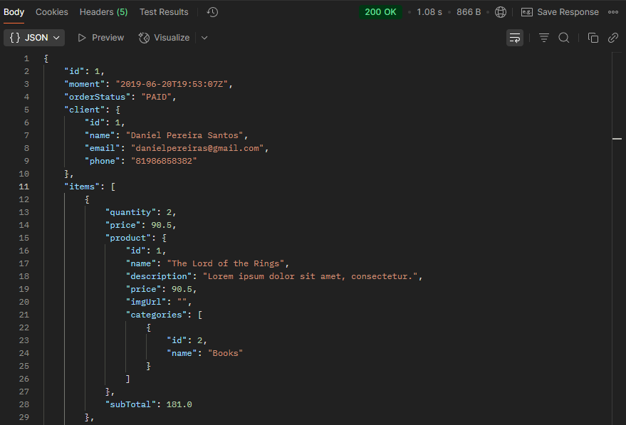
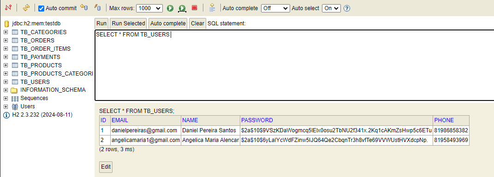
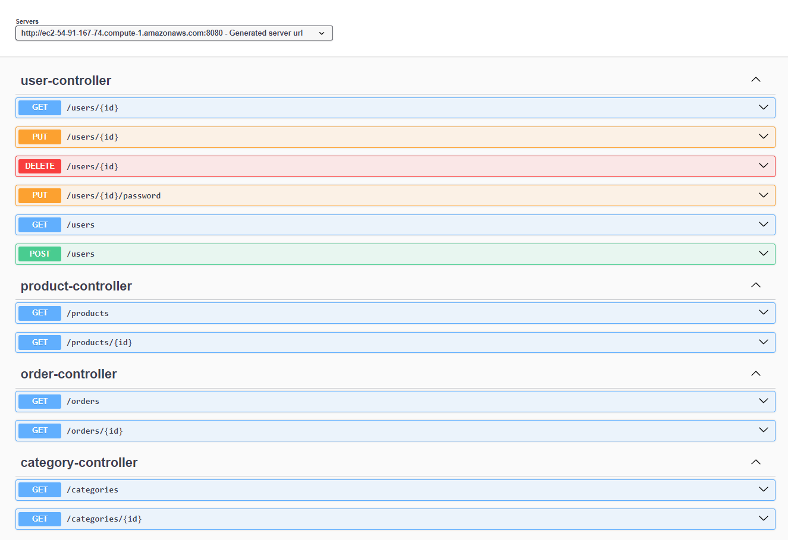

Order System API

🇧🇷 Versão em Português
 | 🇺🇸 English Version

🇧🇷 Versão em Português
Descrição

API REST de um sistema de pedidos para gerenciamento de usuários, produtos, categorias e pedidos.
Desenvolvida em Java 17 com Spring Boot, JPA/Hibernate, e camada de segurança robusta com Spring Security (autenticação e autorização).

O projeto segue boas práticas de arquitetura (camadas, DTOs, tratamento centralizado de exceções) e oferece cobertura de testes para os principais serviços e controllers utilizando JUnit 5 e Mockito.

Além disso, o projeto foi conteinerizado com Docker e implantado na AWS via EC2, garantindo portabilidade e escalabilidade.

Principais Tecnologias e Bibliotecas

Java 17

Spring Boot 3

Spring Data JPA (Hibernate)

Spring Security

Lombok

Banco de Dados H2 (em memória)

JUnit 5 e Mockito (testes)

Maven

Docker (conteinerização)

AWS EC2 (deploy em nuvem)

Estrutura do Projeto

entities – Modelos de domínio: User, Order, Product, Category, OrderItem, Payment

dtos – Data Transfer Objects para abstrair e proteger as entidades nas respostas e requisições (incluindo PasswordDTO para atualização de senha)

repositories – Interfaces JPA para persistência e consultas no banco

services – Camada de lógica de negócio/validações

controllers – Endpoints RESTful organizados por recurso (User, Order, Product, Category)

config – Configurações globais e de segurança

exceptions – Tratamento centralizado e personalizado de erros/exceções

Segurança

Autenticação e Autorização com Spring Security

Senhas criptografadas (PasswordEncoder)

Endpoints sensíveis protegidos

Permissão diferenciada por perfil (em desenvolvimento)

Relacionamentos das Entidades

User 1 — * Order (Um usuário pode possuir vários pedidos)

Order 1 — * OrderItem (Cada pedido tem vários itens)

OrderItem * — 1 Product (Um item sempre aponta para um produto)

Order 1 — 1 Payment (Pagamento é exclusivo e único por pedido)

Product * — * Category (Relação muitos para muitos)

Endpoints Principais

Testes

Cobertura para controllers e services (JUnit, Mockito)

Testes unitários validados para User, Order, Product e Category

Simulação de requests e verificações de fluxo de negócio

Como Executar Localmente
1️⃣ Via Java/Maven

Clone o repositório

Requisitos: Java 17+ e Maven instalado

Execute:

mvn spring-boot:run

Acesse o banco H2: http://localhost:8080/h2-console

JDBC URL: jdbc:h2:mem:testdb

Usuário: root

Senha: root

Via Docker

Build da imagem:

docker build -t order-system-api .

Executar o container:

docker run -p 8080:8080 order-system-api

Acesse Swagger e endpoints via: http://localhost:8080/swagger-ui/index.html

O projeto já foi deployado com sucesso em AWS EC2, mostrando que a aplicação é escalável e pronta para produção.

Observações & Aprendizados

Arquitetura e boas práticas: Aprimoramento do design em camadas, uso de DTOs para proteger entidades e desacoplar camadas.

Tratamento de exceções: Implementação de tratamento centralizado e mensagens claras para o cliente, incluindo erros de autenticação, autorização e validação.

Segurança: Criptografia de senhas, endpoints protegidos, atualização segura de senha via DTO.

Relacionamentos complexos: Mapeamento de relações 1–*, *–1 e – com JPA/Hibernate, incluindo PKs compostas e Collections.

Testes unitários e integração: Cobertura para serviços e controllers com JUnit 5 e Mockito, simulando fluxos de negócio reais.

Conteinerização e deploy em nuvem: Desafios de criar Dockerfile eficiente, configurar ambiente e realizar deploy na AWS EC2.

Aprendizado prático de DevOps: Integração de Spring Boot, Docker e AWS, resolvendo problemas de compatibilidade e configuração de rede.

Autor

Diego Melo Bezerra dos Santos
diegobrsantosdev@gmail.com

GitHub

🇺🇸 English Version
Description

REST API for an order system to manage users, products, categories, and orders.
Developed with Java 17, Spring Boot, JPA/Hibernate, and a robust security layer using Spring Security (authentication and authorization).

The project follows best practices in architecture (layers, DTOs, centralized exception handling) and provides test coverage for main services and controllers using JUnit 5 and Mockito.

Additionally, the project was containerized with Docker and deployed on AWS via EC2, ensuring portability and scalability.

Main Technologies and Libraries

Java 17

Spring Boot 3

Spring Data JPA (Hibernate)

Spring Security

Lombok

H2 Database (in-memory)

JUnit 5 and Mockito (testing)

Maven

Docker (containerization)

AWS EC2 (cloud deployment)

Project Structure

entities – Domain models: User, Order, Product, Category, OrderItem, Payment

dtos – Data Transfer Objects to abstract and protect entities in requests/responses (including PasswordDTO)

repositories – JPA interfaces for database persistence and queries

services – Business logic/validation layer

controllers – RESTful endpoints organized by resource (User, Order, Product, Category)

config – Global and security configurations

exceptions – Centralized and customized exception handling

Security

Authentication and Authorization with Spring Security

Passwords encrypted (PasswordEncoder)

Protected sensitive endpoints

Entity Relationships

User 1 — * Order (A user can have multiple orders)

Order 1 — * OrderItem (Each order has multiple items)

OrderItem * — 1 Product (An item always points to a product)

Order 1 — 1 Payment (Payment is unique per order)

Product * — * Category (Many-to-many relationship)

Main Endpoints

Tests

Coverage for controllers and services (JUnit, Mockito)

Unit tests for User, Order, Product, and Category

Simulation of requests and verification of business flows

Running Locally
Via Java/Maven

Clone the repository

Requirements: Java 17+ and Maven installed

Run:

mvn spring-boot:run

Access H2 database: http://localhost:8080/h2-console

JDBC URL: jdbc:h2:mem:testdb

User: root

Password: root

Via Docker

Build the image:

docker build -t order-system-api .

Run the container:

docker run -p 8080:8080 order-system-api

Access Swagger and endpoints via: http://localhost:8080/swagger-ui/index.html

The project has been successfully deployed on AWS EC2, demonstrating that the application is scalable and production-ready.

Observations & Learnings

Architecture and Best Practices: Improved layered design, use of DTOs to protect entities and decouple layers.

Exception Handling: Implemented centralized error handling with clear messages for the client, including authentication, authorization, and validation errors.

Security: Password encryption, protected endpoints, and secure password updates via DTO.

Complex Relationships: Mapped 1–*, *–1, and – relationships with JPA/Hibernate, including composite PKs and Collections.

Unit and Integration Testing: Coverage for services and controllers using JUnit 5 and Mockito, simulating real business flows.

Containerization and Cloud Deployment: Challenges creating an efficient Dockerfile, configuring the environment, and deploying on AWS EC2.

Practical DevOps Learning: Integration of Spring Boot, Docker, and AWS, solving compatibility and network configuration issues.

Author

Diego Melo Bezerra dos Santos
diegobrsantosdev@gmail.com

GitHub
