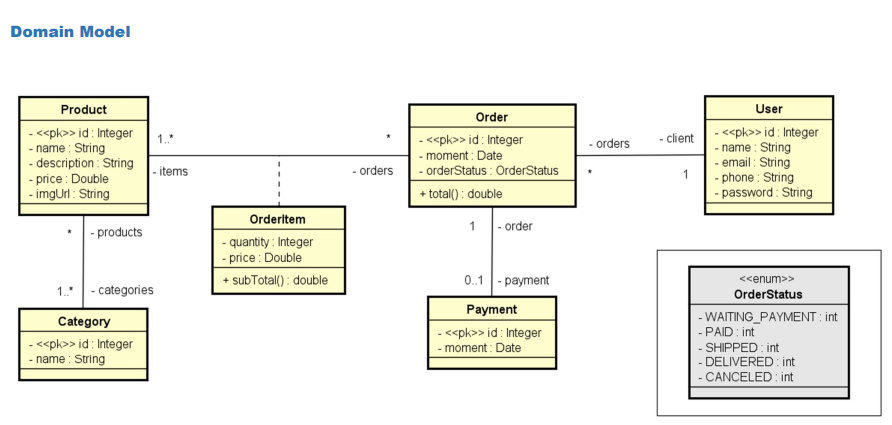

# Order System API
[🇧🇷 Versão em Português](#vers%C3%A3o-em-portugu%C3%AAs) | [🇺🇸 English Version](#english-version)
## 🇧🇷 Versão em Português
### Descrição
API REST para gerenciamento de usuários, produtos, categorias e pedidos.
Desenvolvida em Java 17 com Spring Boot, JPA/Hibernate, e camada de segurança robusta com **Spring Security** (autenticação e autorização).
O sistema segue boas práticas de arquitetura (camadas, DTOs, tratamento centralizado de exceções) e oferece cobertura de testes para os principais serviços e controllers utilizando JUnit 5 e Mockito.

### Status
**Em desenvolvimento**

> Novas funcionalidades, endpoints e integrações podem ser acrescentadas a qualquer momento.
> 

### Principais Tecnologias e Bibliotecas
- **Java 17**
- **Spring Boot 3**
- **Spring Data JPA** (Hibernate)
- **Spring Security**
- **Lombok**
- **Banco de Dados H2** (em memória)
- **JUnit 5** e **Mockito** (testes)
- **Maven**

### Estrutura do Projeto
- **entities**
Modelos de domínio: User, Order, Product, Category, OrderItem, Payment
- **dtos**
Data Transfer Objects para abstrair e proteger as entidades nas respostas e requisições (incluindo **PasswordDTO** para atualização de senha)
- **repositories**
Interfaces JPA para persistência e consultas no banco
- **services**
Camada de lógica de negócio/validações
- **controllers**
Endpoints RESTful organizados por recurso (User, Order, Product, Category)
- **config**
Configurações globais e de segurança (ex.: segurança, testes)
- **exceptions**
Tratamento centralizado e personalizado de erros/exceções

### Segurança
- **Autenticação e Autorização com Spring Security**
    - Senhas criptografadas (PasswordEncoder)
    - Endpoints sensíveis protegidos
    - Permissão diferenciada por perfil (em desenvolvimento)

- **DTOs para senha**
    - Atualização segura do password via endpoint próprio e DTO

- **Tratamento padronizado de exceções**
    - Erros bem documentados e mensagens amigáveis para o cliente

### Relacionamentos das Entidades



- **User** 1—* **Order** (Um usuário pode possuir vários pedidos)
- **Order** 1—* **OrderItem** (cada pedido tem vários itens)
- **OrderItem** *—1 **Product** (um item sempre aponta para um produto)
- **Order** 1—1 **Payment** (pagamento é exclusivo e único por pedido)
- **Product** _—_ **Category** (relação muitos para muitos)
- Todos mapeados com JPA/Hibernate usando Collections, PKs compostas, etc.

_(Diagrama visual pode ser adicionado em breve)_
### Endpoints Principais

Swagger: http://localhost:8080/swagger-ui/index.html

#### Usuários (`/users`)

| Método | Endpoint | Descrição | Auth |
| --- | --- | --- | --- |
| GET | `/users` | Listar todos os usuários | ✅ |
| GET | `/users/{id}` | Buscar usuário por ID | ✅ |
| POST | `/users` | Cadastrar novo usuário | 🚫 |
| PUT | `/users/{id}` | Atualizar dados do usuário | ✅ |
| DELETE | `/users/{id}` | Remover usuário | ✅ |
| PATCH | `/users/{id}/password` | Atualizar senha do usuário | ✅ |
#### Produtos (`/products`)

| Método | Endpoint | Descrição | Auth |
| --- | --- | --- | --- |
| GET | `/products` | Listar todos os produtos | 🚫 |
| GET | `/products/{id}` | Buscar produto por ID | 🚫 |
| POST | `/products` | Cadastrar produto | ✅ |
#### Categorias (`/categories`)

| Método | Endpoint | Descrição | Auth |
| --- | --- | --- | --- |
| GET | `/categories` | Listar todas as categorias | 🚫 |
| POST | `/categories` | Cadastrar nova categoria | ✅ |
#### Pedidos (`/orders`)

| Método | Endpoint | Descrição | Auth |
| --- | --- | --- | --- |
| GET | `/orders` | Listar todos os pedidos | ✅ |
| GET | `/orders/{id}` | Buscar pedido por ID | ✅ |
| POST | `/orders` | Criar novo pedido | ✅ |

> ⚠️ Endpoints marcados como `✅` exigem autenticação.
> ⚠️ Lista pode ser expandida conforme evolui o projeto.
> 

### Testes
- **Cobertura para controllers e services** (Junit, Mockito)
- Testes unitários validados para User, Order, Product e Category
- Simulação de requests e verificações de fluxo de negócio

### Como Executar Localmente
1. Clone o repositório
2. Requisitos: Java 17+, Maven instalado
3. Execute:
``` 
   mvn spring-boot:run
```
1. Acesse o banco H2:
[http://localhost:8080/h2-console](http://localhost:8080/h2-console)
JDBC URL:
Usuário: `root` • Senha: `root` `jdbc:h2:mem:testdb`

### Observações & Aprendizados
- Utilização de **@JsonIgnore** para evitar loops de serialização em entidades com relacionamentos bidirecionais.
- Uso de **DTOs** para resposta e requisição, garantindo segurança e desacoplamento das entidades.
- Tratamento amigável e padronizado de exceções.

### Autor
**Diego Melo Bezerra dos Santos**
diegobrsantosdev@gmail.com
[GitHub](https://github.com/diegobrsantosdev)
## 🇺🇸 English Version
### Description
REST API for managing users, products, categories, and orders.
Developed with Java 17, Spring Boot, JPA/Hibernate, and robust security using **Spring Security** (authentication and authorization).
The system follows best practices for layered architecture, uses DTOs, centralized exception handling, and includes tests for main services/controllers using JUnit 5 and Mockito.
### Status
**In development**

> New features, endpoints and integrations will be added as the project evolves.
> 

### Main Technologies & Libraries
- **Java 17**
- **Spring Boot 3**
- **Spring Data JPA** (Hibernate)
- **Spring Security**
- **Lombok**
- **H2 Database** (in-memory)
- **JUnit 5** and **Mockito** (testing)
- **Maven**

### Project Structure
- **entities**
Domain models: User, Order, Product, Category, OrderItem, Payment
- **dtos**
Data Transfer Objects for secure & clean API requests/responses (including **PasswordDTO** for password updates)
- **repositories**
JPA repositories for persistence and database queries
- **services**
Business logic and validations
- **controllers**
REST endpoints by resource (User, Order, Product, Category)
- **config**
Security and global configuration
- **exceptions**
Centralized and custom error handling

### Security
- **Authentication & Authorization with Spring Security**
    - Passwords encrypted (PasswordEncoder)
    - Sensitive endpoints protected
    - Role-based permissions (in development)

- **DTO for password operations**
    - Secure password updates through dedicated endpoint/DTO

- **Standardized Error Handling**
    - Clear and friendly error responses for clients

### Entity Relationships
- **User** 1—* **Order** (One user can have many orders)
- **Order** 1—* **OrderItem** (Order contains multiple items)
- **OrderItem** *—1 **Product** (Each item refers to a product)
- **Order** 1—1 **Payment** (One payment per order)
- **Product** _—_ **Category** (Many-to-many relation)
- All mapped with JPA/Hibernate, composite PKs, etc.

_(Visual diagram may be added soon)_
### Main Endpoints

Swagger: http://localhost:8080/swagger-ui/index.html

#### Users (`/users`)

| Method | Endpoint | Description | Auth |
| --- | --- | --- | --- |
| GET | `/users` | Retrieve all users | ✅ |
| GET | `/users/{id}` | Retrieve user by ID | ✅ |
| POST | `/users` | Create new user | 🚫 |
| PUT | `/users/{id}` | Update user information | ✅ |
| DELETE | `/users/{id}` | Delete user | ✅ |
| PATCH | `/users/{id}/password` | Update user password | ✅ |
#### Products (`/products`)

| Method | Endpoint | Description | Auth |
| --- | --- | --- | --- |
| GET | `/products` | Retrieve all products | 🚫 |
| GET | `/products/{id}` | Retrieve product by ID | 🚫 |
| POST | `/products` | Create new product | ✅ |
#### Categories (`/categories`)

| Method | Endpoint | Description | Auth |
| --- | --- | --- | --- |
| GET | `/categories` | Retrieve all categories | 🚫 |
| POST | `/categories` | Create new category | ✅ |
#### Orders (`/orders`)

| Method | Endpoint | Description | Auth |
| --- | --- | --- | --- |
| GET | `/orders` | Retrieve all orders | ✅ |
| GET | `/orders/{id}` | Retrieve order by ID | ✅ |
| POST | `/orders` | Create new order | ✅ |

> ⚠️ Endpoints marked with `✅` require authentication.
> ⚠️ This list may grow as project evolves.
> 

### Testing
- **Controller & Service layer tests** (JUnit, Mockito)
- Unit tests implemented for User, Order, Product, and Category flows
- Automated request simulation and business logic validation

### How to Run Locally
1. Clone the repository
2. Requirements: Java 17+, Maven
3. Run:
``` 
   mvn spring-boot:run
```
1. Access H2 Database Console:
[http://localhost:8080/h2-console](http://localhost:8080/h2-console)
JDBC URL:
Username: `root` • Password: `root` `jdbc:h2:mem:testdb`

### Notes & Learnings
- Use of **@JsonIgnore** to avoid infinite serialization loops in bidirectional entities.
- **DTOs** for safe and decoupled API requests/responses.
- Friendly and standardized exception handling.

### Author
**Diego Melo Bezerra dos Santos**
diegobrsantosdev@gmail.com
[GitHub](https://github.com/diegobrsantosdev)
